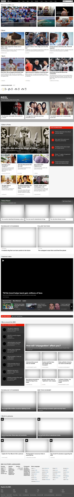

# A robot that takes full page screenshots of given websites

[](http://www.youtube.com/watch?v=aQkXTHP3Xxw)

- Reads the website data (URL, accept cookies selector) from a `.csv` file using the [`RPA.Tables`](https://robocorp.com/docs/libraries/rpa-framework/rpa-tables) library.

- Uses the [Playwright](https://playwright.dev/)-based [Robot Framework Browser](https://robotframework-browser.org/) library to take full page screenshots of the websites.

> Read [Using the Robot Framework Browser library](https://robocorp.com/docs/development-guide/browser/playwright) article for more information.

## Example csv file

`websites.csv`:

```
url,accept_cookies_selector,data_consent_selector
https://www.bbc.com/,css=#bbccookies-continue-button,css=button.fc-cta-consent
https://www.nytimes.com/,xpath=//button[@data-testid="expanded-dock-btn-selector"],None
https://www.repubblica.it/,css=.iubenda-cs-accept-btn,None
https://elpais.com/,css=#didomi-notice-agree-button,None
https://timesofindia.indiatimes.com/,css=#consent-continue-button,None
https://www.themoscowtimes.com/,None,None
https://www.japantimes.co.jp/,None,None
```

## Example screenshot

BBC - Homepage


